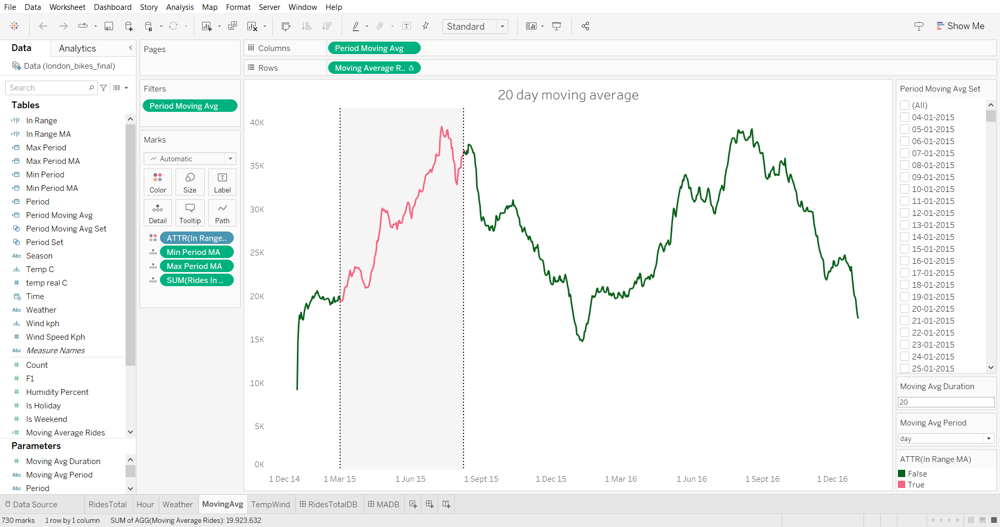
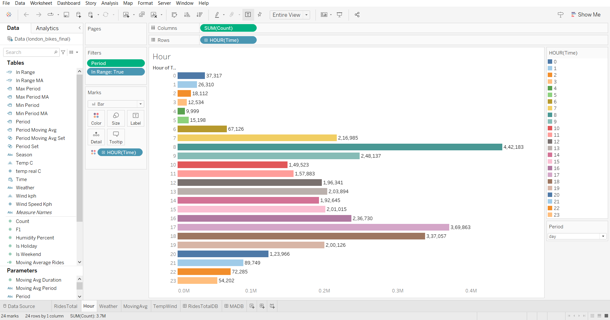

# LONDON BIKE RIDES DATASET🚲

This a Data Visualization project using [Tableau](https://www.tableau.com/) here I learned how to use Tableau and the uses of SQL in data management.

## The Dashboard

## Screenshots

### Sheets

### Dashboards

