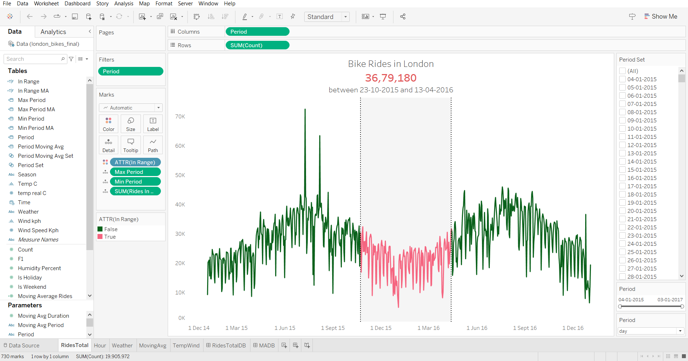

# LONDON BIKE RIDES DATASET🚲

## Overview

This data visualization project aims to explore and visualize the London Bike Sharing dataset using Tableau. The dataset, obtained from Kaggle ([London Bike Sharing Dataset](https://www.kaggle.com/datasets/hmavrodiev/london-bike-sharing-dataset)), contains information about bike rentals in London, including details such as timestamp, weather conditions, and the number of bikes rented.

## Dataset Overview

The London Bike Sharing dataset provides the following key information:

- **timestamp**: Date and time of the bike rental record.
- **cnt**: The count of bikes rented at that timestamp.
- **t1, t2, hum, wind_speed, weather_code, is_holiday, is_weekend**: Various weather and holiday-related parameters affecting bike rentals.

For a detailed description of each column, refer to the [dataset documentation](https://www.kaggle.com/hmavrodiev/london-bike-sharing-dataset).

## The Dashboard


## Screenshots

### Sheets





### Dashboards


## Project Goals

The primary goals of this project are:

1. **Explore Trends**: Identify trends and patterns in bike rentals over time.
2. **Weather Impact**: Analyze how weather conditions influence bike rentals.
3. **Holiday and Weekend Trends**: Examine the impact of holidays and weekends on bike sharing.
4. **User Engagement**: Investigate user engagement during different times of the day.

## Tableau Visualizations

The visualizations are created using Tableau and are organized as follows:

1. **Time Series Analysis**: Line charts to visualize the overall trend in bike rentals over time.
2. **Weather Impact Dashboard**: Heatmaps and charts showing how weather conditions correlate with bike rentals.
3. **Holiday and Weekend Trends**: Bar charts illustrating bike rentals during holidays and weekends.
4. **User Engagement Analysis**: Pie charts and bar graphs representing user engagement during different hours of the day.

## Instructions

To view the visualizations, follow these steps:

1. **Install Tableau**: If you don't have Tableau installed, download and install it from the [official Tableau website](https://www.tableau.com/).
2. **Clone the Repository**: Clone this repository to your local machine.
   ```bash
   git clone https://github.com/debarshee2004/london_bike_ride.git
   ```
3. **Open Tableau Workbook**: Open Tableau and navigate to the cloned repository. Open the Tableau workbook file (e.g., `london_bike_sharing.twb`).
4. **Explore Visualizations**: Interact with the visualizations to gain insights into the London Bike Sharing dataset.

## License

This project is licensed under the [Apache 2.0 License](LICENSE).